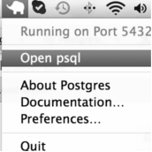

# An introduction to relational databases

## Instructions

Fork and clone this repository.

Please remember that demonstrations are to take notes, code alongs are to write code with instructor, and practices are to write code with the support of the instructional team.

## Objectives

By the end of this lesson, students should be able to:

- Create a database table
- Insert a row or rows into a database table
- Retrieve a row or rows from a database table
- Modify a database table after creation
- Update a row or rows in a database table
- Delete a row or rows from a database table

## Prerequisites

- A working **[PostgreSQL](http://www.postgresql.org/)** installation.
- Required reading: http://www.postgresql.org/docs/9.4/static/tutorial.html (please skip _3. Advanced Features_)

## Introduction

At it's simplest, a relational database is a mechanism to store and retrieve data in a tabular form.

Spreadsheets are a good analogy.  Individual sheets as tables and the whole spreadsheet as a database.  See **[this link](https://docs.google.com/spreadsheets/d/11oSk85me0klRDfa6o7OfkzMVnvOuhxsF9W-bQEPP5wk/edit?usp=sharing)** for an example.

Why is this important?

Database tables are a good place to store key/value pairs, as long as the values are simple types (e.g. string, number).  The keys are the column names and the values are stored in each row. That maps well to simple JSON objects.  A group of rows from one table maps well to a JSON array.

What about more complicated data?

Database tables can reference other tables which allows arbitrary nesting of groups of simple types.  This is something we'll be looking at more closely later.

### Relational database management system ([RDBMS](http://en.wikipedia.org/wiki/Relational_database_management_system))

A **[Database Server](http://upload.wikimedia.org/wikipedia/commons/5/57/RDBMS_structure.png)** is a set of processes and files that manage the databases that store the tables.  Sticking with our previous analogy a database server would map to Google Sheets.

### Verb equivalence

**[CRUD](http://en.wikipedia.org/wiki/Create,_read,_update_and_delete)** _(create, read, update and delete)_, SQL, and HTTP

  CRUD | SQL    | HTTP
------ | ------ | ---------
Create | INSERT | POST
Read   | SELECT | GET
Update | UPDATE | PATCH
Delete | DELETE | DELETE

## PostgreSQL

We'll be using **[PostgreSQL](http://www.postgresql.org/)**, a popular open source database server, which should already be installed on your computer.


*On Macs*, you'll see the PostgreSQL elephant in the task bar if the server is running: 

If the server isn't running, please start it from the `/Applications` folder.

### Create a database

#### Code along

We'll use `sql-crud` as the database to hold our tables and **[psql](http://www.postgresql.org/docs/9.4/static/app-psql.html)** to interact with it.  `psql` is PostgreSQL's command line client which lets us execute SQL commands interactively (REPL-like) and from scripts.  It also has some built in commands we'll find useful.

```bash
$ psql sql-crud
psql: FATAL:  database "sql-crud" does not exist
$
```

But first we need to create the database.  We'll use the **[CREATE DATABASE](http://www.postgresql.org/docs/9.4/static/sql-createdatabase.html)** command from within `psql`.  This is a  **[SQL](http://www.postgresql.org/docs/9.4/static/sql.html)** _(Structure Query Language - see also the [Wikipedia article](http://en.wikipedia.org/wiki/SQL))_ command and requires that we wrap the database name in double quotes (i.e. `create database "sql-crud";`). A `-` is not allowed as a name character in SQL unless the name is surrounded with double-quotes.

If we run `psql` without a parameter it will connect to our default database, usually named with our login.

```bash
$ psql
```

```sql
psql (9.4.5)
Type "help" for help.

and=> CREATE DATABASE "sql-crud";
CREATE DATABASE
and=>
```

Once we've created the database we can access it using the psql built-in command `\c` (for connect):

```sql
and=> \c sql-crud
You are now connected to database "sql-crud" as user "and".
sql-crud=>
```

Or we can access it from the command line using the psql command and passing the database name as an argument:

```bash
$ psql sql-crud
```

```sql
psql (9.4.5)
Type "help" for help.

sql-crud=>
```

`psql` has help for both its built-in commands and for SQL.

```sql
psql (9.4.5)
Type "help" for help.

sql-crud=> help
You are using psql, the command-line interface to PostgreSQL.
Type:  \copyright for distribution terms
       \h for help with SQL commands
       \? for help with psql commands
       \g or terminate with semicolon to execute query
       \q to quit
sql-crud=>
```

Let's look at some of the help for `psql` commands.

- `\l` lists all the databases created on the server we're connected to.
- `\d` (and its variations) shows information about the objects in the current database.
- `\i` reads commands from a file

### Creating tables

We create a table to define the names and types of the data we want to store about an object.

PostgreSQL's documentation is extensive and excellent, and we'll want to make use of it throughout the lesson.

- [Table basics](http://www.postgresql.org/docs/9.4/static/ddl-basics.html) - a brief overview of tables in an RDBMS
- [Data Types](http://www.postgresql.org/docs/9.4/static/datatype.html) - the data types available in PostgreSQL
- [CREATE TABLE](http://www.postgresql.org/docs/9.4/static/sql-createtable.html) - detailed documentation of PostgreSQL's version of the SQL `CREATE TABLE` command


#### Demonstration

We'll create a table to hold people.  By convention (the one we'll use throughout), tables are named with the pluralization of the name of the object whose data they hold.  So, if each row is the data for a person, then the table is called people.  By another convention, each table will have an `id` column that uniquely identifies each row.  We'll use the first line of `data/people.csv` for the rest of the column names.

What data-types should we use for each column?

We'll save the SQL statement to create the people table in `create_table/people.sql`.  We can execute the commands in the file using `psql -f <file>` or from the psql prompt using `\i <file>`.

#### Code along

Together, we'll create a table to hold information about cities.  We'll use the first row of `data/cities.csv` for the column names.

What data-types should we use for each column?

We'll save the statement in `create_table/cities.sql`

#### Practice

Create a table to hold information about pets using the first row of `data/pets.csv` for the names of the columns other than `id`.  Use `create_table/cities.sql` to store the SQL statement.

Once you've created the table `pets`, create the table `people` from the demonstration.

---

### Adding rows to a table

- [Inserting Data](http://www.postgresql.org/docs/9.4/static/dml-insert.html) - overview of adding rows
- [INSERT](http://www.postgresql.org/docs/9.4/static/sql-insert.html) - detailed documentation of PostgreSQL's version of the SQL `INSERT INTO` command
- [COPY](http://www.postgresql.org/docs/9.4/static/sql-copy.html) - detailed documentation of PostgreSQL's `COPY` command for loading data in bulk

For inserting bulk data, PostgreSQL provides the `COPY` command.  We won't use that command directly, as it executes relative to the server installation, rather we'll use `psql`'s meta-command `\copy` allowing us to load data relative to where we run `psql`. Bulk loading is something available with most RDBMSs, but the specific commands and capabilities vary.

#### Demonstration

People

Note that string literals in SQL statements are delimited by single quotes, i.e. `'`.  To include a single quote in a string literal, double them, e.g. `'That''s interesting'`.  This is not an issue when loading from a valid CSV file using `COPY` or `\copy`.

#### Code along

Cities

#### Practice

Pets then People

---

### Retrieving rows from a table

This is about the *query* part of Structured _Query_ Language.

- [Queries](http://www.postgresql.org/docs/9.4/static/queries.html)
- [SELECT](http://www.postgresql.org/docs/9.4/static/sql-select.html)

#### Demonstration

People

#### Code along

Cities

#### Practice

Pets then People

---

### Changing the structure of a table

- [Modifying Tables](http://www.postgresql.org/docs/9.4/static/ddl-alter.html)
- [ALTER TABLE](http://www.postgresql.org/docs/9.4/static/sql-altertable.html)

#### Demonstration

People

#### Code along

Cities

#### Practice

Pets then People

---

### Changing rows in a table

- [Updating Data](http://www.postgresql.org/docs/9.4/static/dml-update.html)
- [UPDATE](http://www.postgresql.org/docs/9.4/static/sql-update.html)

#### Demonstration

People

#### Code along

Cities

#### Practice

Pets then People

---

### Removing rows from a table

- [Deleting Data](http://www.postgresql.org/docs/9.4/static/dml-delete.html)
- [DELETE](http://www.postgresql.org/docs/9.4/static/sql-delete.html)

#### Demonstration

People

#### Code along

Cities

#### Practice

Pets then People

